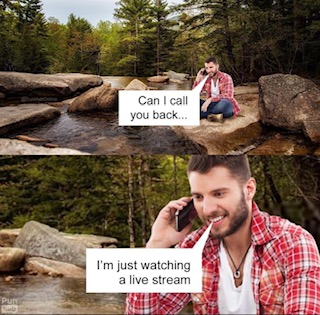
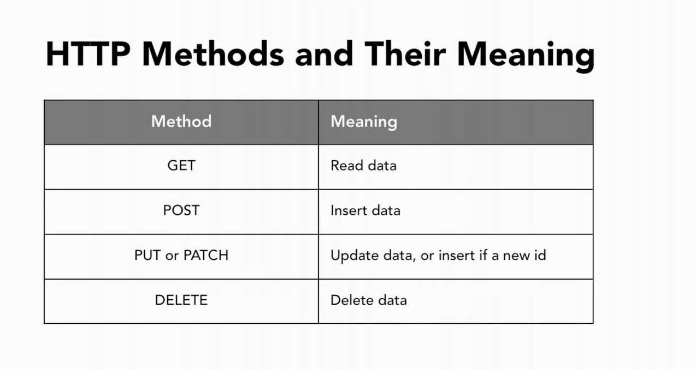
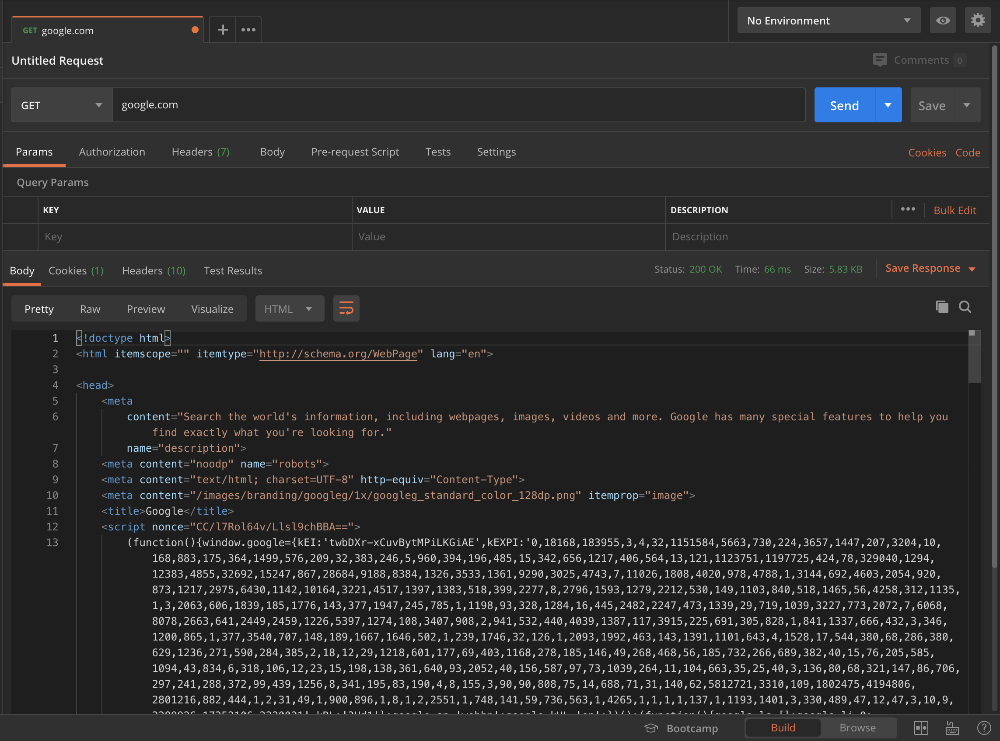

# Intro to the Internet



### SWBATs:

1. Explain in general how the internet works
2. Define the world wide web
3. Describe the client-server model and the request-response lifecycle
4. Utilize Postman to make basic GET requests
5. Utilize the browser to make a request and see a response
6. Define tools like JSON and APIs
7. <del>Make a basic web app in 30 seconds???!!!</del>

______

## History of the Internet

It's commonly cited that the internet was started being developed by the military through DARPA (Department of Defense Advanced Research Projects Agency) and was first connected in October 1969. It was later expanded through the development of TCP/IP by Vint Cerf and Bob Kahn.

The internet is a network of computers all connected by cables. Most often, it's a network of smaller networks together - think home networks, school networks, business networks, and government networks.


These networks are connected through literal cables, and the reason that we can get information from one continent to another is through [underwater fiber optic cables](https://www.submarinecablemap.com/). These cables are thick (for a cable) and branch off at different points until they eventually reach your wall where you likely have a wifi router installed.

Fun fact, [sharks have been known to bite the cables](https://www.youtube.com/watch?v=VVJlKJi9FWU)...


The World Wide Web (IS THAT WHAT THE WWW STANDS FOR IN A WEB ADDRESS?? OMG!!!) is a service that exists on top of the internet and is commonly how most people consume and distribute information on the internet. The web was created in 1989 by Sir Tim Berners-Lee and his colleagues at CERN (European Organization for Nuclear Research).

You can think of the internet as an infrastructure and the World Wide Web as a service on top of that infrastructure. The web contains websites and webpages which are connected through hypertext links which are composed of a URI (uniform resources identifier) and some text. Websites on the internet are written in HTML and are accessible in browsers which communicate using HTTP (Hypertext Transfer Protocol) or HTTPS (Hypertext Transfer Protocol Secured) and can render HTML (Hypertext Markup Language).

Sir Tim Berners-Lee and his colleagues created the World Wide Web as a social invention in order to connect people in the world. He said that he didn't ask for permission when he created it, he just did it. That's a directive for you to also be creative and to find a need for your own inventions!

______

## How is data sent over the internet?
<details>
<summary>
   <a href="https://www.youtube.com/watch?v=pvS3j8VtanM">Packet</a>
</summary>
<pre>
A packet is a fixed size unit of data. 

Normally, when you exchange data between two computers, the data that you're sending is too large to send inside a single packet. 

Therefore, the data is broken up into a bunch of packets and each packet is independently transmitted to the reciever who pieces the packets back together.
</pre>
</details>

<details>
<summary>TCP</summary>
<pre>
<li>Transmission Control Protocol.</li>
<li>How data is sent over the internet.</li>
</pre>
</details>
<details>
<summary><a href="https://stackoverflow.com/questions/5330277/what-are-examples-of-tcp-and-udp-in-real-life">UDP</a></summary>
<pre>
<li>User Datagram Protocol.</li> 
<li>Another form of how data is sent over the internet.</li>
<li>Less reliable than TCP</li>
<li>Faster than TCP</li>
</pre>
</details>
<details>

<summary>IP</summary>
<pre>
<li>Internet Protocol.</li> 
<li>IP address -> who are you, something to identify you on the internet.</li> 
<li>It identifies the connection of a computer on the internet.</li>
<li>It's provided by the network administrator or your Internet Service Provider (ISP).</li>
</pre>
</details>
<details>
<summary>MAC address</summary>
<pre>
<li>Media Access Control.</li> 
<li>It's the physical address that uniquely identifies a hardware interface. 
<li>It's provided by the manufacturer of the Network Interface Card (NIC).
A Network Interface Card is an interface hardware that is used by your computer to become part of a network.</li> 
<li>The MAC address is burned into the ROM of the NIC, so when you change your card, your MAC address also changes.</li> 
<li>Every computing device has a unique MAC address.</li>
</pre>
</details>
<details>
<summary>Difference between MAC address & IP address</summary>
<pre>
<li>IP identifies your network whereas MAC address identifies your unique machine.</li> 
<li>You can think of the MAC address as your name (assuming it is unique in the world) and the IP address as your residential address. 

You can have different addresses at different times but your name would always be the same.</li>
</pre>
</details>
</details>
<details>
<summary>HTTP(S)</summary>
<pre>
<li>HyperText Transfer Protocol.</li> 
<li>Request-response protocol.</li> 
<li>Provides a standard way for web browsers and servers to talk to each other</li>
<li>Underlying protocol used by the World Wide Web.</li>


<b>Some Other Protocols You May Hear:</b>
<li>FTP - File Transfer Protocol</li>
<li>SMTP - Simple Mail Transfer Protocol</li>
</pre>
</details>
<details>
<summary>HTML</summary>
<pre>
HyperText Markup Language
</pre>
</details>

______


## How the Web Works

HTTP (Hypertext Transfer Protocol) is the language of the web and it describes how webpages and files are sent over the internet. The protocol is based on a model of client and server: the client can be a program or a browser that sends a request for information, and the server is the computer that has the information about the web page.

The server that we make this request to is always located using a URL or URI which is composed of a few parts. Consider this URI: https://go.flatironschool.com/getting_started. The first part is the protocol http:// or https:// at the beginning of the URI, which describes the language that we're using to communicate with this website. The next is the domain which can either be an IP address or a string like go.flatironschool.com. When the domain is formatted as a string, we can divide each part of the string into separate parts: `com` is the top-level domain, `flatironschool` is the second-level domain, and we can continue with subdomains like `go` in the example above. Following the domain is a port address which is formatted like go.flatironschool.com:80, but these ports are implicit when accessing servers over either HTTP or HTTPS. And lastly is the resource that you want from this domain. In our example, it's the `/getting_started` resource.

_____

### What Happens When I Press Enter or Click a Link?

As we are browsing the internet and we click a link or type an address to our address bar, we say that a *request* is being made to a server. We're asking another computer somewhere else in the world to send us the webpage (a document) or some other information over the internet so that our browser can read it and present it to us. The _response_ is what our browser gets back from the server. This entire cycle is called the **request-response lifecycle**. When we make a request, we should get a response.

There's actually a bunch of stuff that happens after the request is fired off and before the server even knows about the request. This whole process is called DNS lookup and is how we translate a domain name (or a string of text) into an IP address, which is the permanent address of a web server.

When the browser receives the response, it has some information about the response itself, like its status, as well as a response body. The response body in the case of webpages is the actual HTML of the page. When the browser begins to read this HTML, it sometimes sees that other resources need to be requested for the webpage to be complete. These are usually things like images, fonts, data, or scripts.

In a very specific order, the browser loads all the assets it needs and begins to render the page. The HTML defines the structure as well as most of the external assets needed. The CSS defines how the page should look. The JavaScript defines how the page will behave once loaded and how the user can interact with it.

_____

## Requests and Responses

### Requests

Breaking down the anatomy of requests we can see that there are a few distinct pieces. The request is made up of a request method, the requested resource's path, the protocol, the user-agent, some headers, and a request body.

Headers are extra information that we send that aren't part of the request body itself, but tells the server how to formulate the response.

```
GET /getting_started HTTP/1.1
User-Agent: Mozilla/4.0 (compatible; MSIE5.01; Windows NT)
Host: go.flatironschool.com
Accept-Language: en-us
Accept-Encoding: gzip, deflate
Connection: Keep-Alive
```


The types of request methods, also called HTTP verbs, that we'll see here are GET, POST, PUT/PATCH, DELETE which map to READ, CREATE, UPDATE, and DELETE pretty nicely at first. These allow us to do most of the work that is necessary on the internet.

The main difference between GET requests and POST and PATCH requests is that both POST and PATCH requests will have a request body, which is information that we send to the server to be processed. We'll talk about ways to format that information later on.



### Responses

HTTP Responses are formatted similarly to requests except for a few components. They have the protocol listed, the response status, some headers, and most responses will have a response body attached.

Here, headers are extra information that the server wants to communicate with the browser about this request. This could be information on how to cache the response body or just information about the server itself.

The two most important pieces to keep in mind are the [__status code__](https://http.cat/) and the __response body__. The [status code](https://httpstatusdogs.com/) tells us in summary what happened. When you go to a web page on your browser and you see what you requested, most likely the response code is 200 OK. Other common response codes are 404 meaning Not Found and 500 meaning Internal Server Error. If you forget or don't know what a status code means, you can simply google it and find out. Status codes will be useful debugging tools for us.

```
HTTP/1.1 404 Not Found
Date: Sun, 18 Oct 2012 10:36:20 GMT
Server: Apache/2.2.14 (Win32)
Content-Length: 230
Connection: Closed
Content-Type: text/html; charset=iso-8859-1

<!DOCTYPE HTML PUBLIC "-//IETF//DTD HTML 2.0//EN">
<html>
<head>
   <title>404 Not Found</title>
</head>
<body>
   <h1>Not Found</h1>
   <p>The requested URL /t.html was not found on this server.</p>
</body>
</html>
```


_____

## [Postman](https://www.postman.com/)

Postman is a client that lets you make all type of requests in a fairly easy to use UI. You can download it free from its website and it's great for testing APIs as well as learning how different types of request work and what's needed for each.



In the picture above, we make a request using Postman to `google.com`. Using the raw tab, you will be able to see how the response is simply a bunch of text. Using the pretty tab, you can see that it's HTML. You can see a preview of the html page returned from the request using the preview tab.

_____

## Anatomy of a URL

There's a ton of information we can get simply from looking at the URL! The picture below breaks it down well. The protocol is like HTTP or HTTPS. HTTPS is always on port 443 and HTTP is on port 80, but the port number won't always be displayed. You'll see the `:443` port number change a lot when you're working on development mode on your local computer depending on what server framework you're using. The path is the specific resource that is being requested from `domain.com`.


____

#### Other Tools:
- ping
- traceroute
- location - https://en.geoipview.com/
- nslookup
- whois

____

#### Review Questions


<p>
<details>
<summary>What is a server? What is a client?</summary>
<pre>
A server takes requests from one or more clients and shares its resources, applications and/or data. A client is a computing device (computer, browser, iphone, tablet,...) that initiates contact with a server
</pre>
</details>
</p>

<p>
<details>
<summary>Give a general overview of what happens when we enter a link into the browser?</summary>
<pre>
The browser, which is the client, sends a request to the server located at the IP address associated with the domain. The server receives and reviews the request, then it sends back whatever data the client asked for. The client recieves the response and renders it appropriately for the user.
</pre>
</details>
</p>

<p>
<details>
<summary>What is JSON?</summary>
<pre>
A language agnostic data format. It's a type of string that we can get back from websites sometimes and it looks a lot like a Ruby Hash. We can actually convert it into a Ruby Hash, so that we can call Ruby methods on it.
</pre>
</details>
</p>

______

#### Extra Resources

##### Learn More & Understand Concepts More in Depth
- [A Journey to the Bottom of the Internet](https://youtu.be/H9R4tznCNB0)
- [Fun HTTPS Webcomic About HTTP](https://howhttps.works/why-do-we-need-https/)
- [Fun Webcomic About DNS](https://howdns.works/ep1/)
- [How Stuff Works: Packets](https://computer.howstuffworks.com/question525.htm)
- DNS Spoofing

##### History
- [Who Invented the Internet?](https://learn.onemonth.com/who-invented-the-internet/)
- [First Website](http://info.cern.ch/hypertext/WWW/TheProject.html)
- [Who Owns the Internet??](https://www.webopedia.com/DidYouKnow/Internet/WhoOwnstheInternet.asp)

##### Terminology
- [What are the parts of a URL and what do they do?](https://www.mattcutts.com/blog/seo-glossary-url-definitions/)
- [Difference between URI & URL](https://stackoverflow.com/questions/176264/what-is-the-difference-between-a-uri-a-url-and-a-urn)

##### Internet Privacy
- [TIPS, TOOLS AND HOW-TOS FOR SAFER ONLINE COMMUNICATIONS](https://ssd.eff.org/en#index)