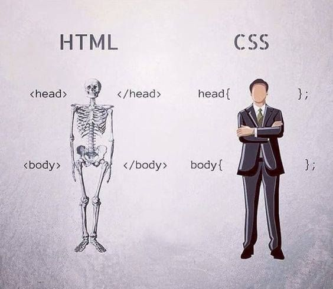

# CSS & HTML



### SWBATs
1. Understand the purpose of HTML & CSS
2. Understand box model
3. Describe the purpose of h1 - h6, title, and body tags
4. Use CSS selectors to target HTML elements


___
### CSS examples...
- [Geocities-izer](https://www.wonder-tonic.com/geocitiesizer/)
- [Ling's Cars](https://www.lingscars.com/)
- [Code Pen Hot Air Balloon](https://codepen.io/SundayRobot/pen/RVqMdq)
- [NYC Subway Animation](https://codepen.io/mike-schultz/pen/Xgeapr)
- [Square Animation](https://codepen.io/valhead/pen/htmKk)
- [Mexican Flag](https://codepen.io/jesusrmz/pen/XBqZjJ)

___

## HTML

- `<head> </head>` - information for the browser and search engines about how to render your page
- `<title> </title>` - text to be shown on browser tab
- `<body> </body>` - the content of the webpage

### Box Model

All HTML elements can be considered as boxes! We can think of every HTML element being wrapped in a box that contains a margin, padding, border, and the content.

- Content - the text or images displayed on the webpage
- Border - the line/border that goes around the content and padding
- Padding - the space between the border and content; transparent
- Margin - the space outside of the border or between elements; transparent

#### More info
- [W3schools Box Model](https://www.w3schools.com/css/css_boxmodel.asp)


### h1, h2, h3, ... h6

The main purpose of the different headers is actually NOT for styling! Their main purpose is for screen readers to be better able to navigate your webpage and for search engines to be able to learn what your webpage is about. One of the best semantic HTML practices is to only have one `<h1>` tag on a webpage. This will make it easier for screen readers and search engines to know what your webpage is about. Moreover, you can have many of the other headers (`<h2>` to `<h6>`). Although each of these header elements has default styling, style including sizing can always be overwritten!


____

## Styling!

### How to Add CSS to Our HTML??

We have three options - inline, internal, or exporting an external CSS file. The best practice is having your CSS in its own separate file from the HTML!

- Inline
    
    ```HTML
    <h1 style="color: blue;"> Hello World </h1>
    ```
    
- Internal
    ```HTM
        <style> <style/>
    ```
- External import external page
    ```HTM
        < link rel="stylesheet" href="styles.css" >
    ```


### Intro to Selectors

- **Targeting elements! (Element Selector)**

    Let's say you want to style all `<h2>` elements on your webpage a certain way. You need to target that  element in your CSS file. You can target the elements as such:
    ```CSS
    h2 {
        /* styling here */
    }
    ```

    This is saying that you want some styling for ALL `<h1>` elements.

- **Targetting classes! (Class Selector)**

    Let's say you have the following HTML:
    ```HTML
    <section class="langauges">
        <h2>Ruby</h2>
        <p>Lorem ipsum dolor sit amet.</p>
    </section>

    <section class="langauges">
        <h2>Java</h2>
        <p>In everti accusamus abhorreant duo.</p>
    </section>

    <section class="langauges">
        <h2>Python</h2>
        <p>Exerci molestiae ei nam?</p>
    </section>
    ```
    And from the above HTML, you wish to style each section element that has a class of `languages`. You can target a class in CSS using a period as such:
    ```CSS
    .languages {
        /* styling here */
    }
    ```
    In the CSS above, you are saying that you want to target all elements that have a class of `languages`.


- **Targetting IDs! (ID Selector)**
    
    IDs are a more specific way to identify an element than a class. Let's say you have the following HTML:
    ```HTML
    <section id="langauges">
        <h2>Java</h2>
        <p>In everti accusamus abhorreant duo.</p>
    </section>

    <section class="langauges">
        <h2>Python</h2>
        <p>Exerci molestiae ei nam?</p>
    </section>
    ```
    And from the above HTML, you wish to style the secion with the id of `languages`. You can target the element by its class in CSS using a hashtag as such:
    ```CSS
    #langauges{
        /* styling here */
    }
    ```


 - **Targetting multiple things**!

    Let's say you have the following HTML:
    ```HTML
    <h1>Puppies</h1>
    <article>
        <h2>Poodles</h2>
        <h3>Favorite Treats</h3>
        <p class="poodle-fave-treats">
            Poodles love food.
        </p>
    </article>
    ```
    Let's say you want to add the same styling to the `h1` tag, the `h2` tag, and the element with the class `poodle-fave-treats`. You could group them in your selectors using commas as such:
    ```CSS
    h1, h2, .poodle-fave-treats {
        /* styling here */
    }
    ```
    The above selector is saying you want to target `h1` elements and `h2` elements and elements with `poodle-fave-treats` as a class.

- **Targetting Descendants**!

    Let's say you have the following HTML:
    ```HTML
    <section>
        <h2>Dogs</h2>
        <p>Woof!</p>
    </section>

    <section>
        <h2>Cats</h2>
        <p>Meow!</p>
    </section>
    <div>
        <p>I hope you learned a lot about pets!</p>
    </div>
    ```
    Let's say you only want to target the `p` tags nested under section. You could target just those `p` tags in CSS as such:
    ```CSS
    section p {
        /* some styling */
    }
    ```
    The above is saying you want to target a `p` tag that is nested inside of a `section` tag!


    #### More Info
    - [More CSS Selectors](https://sabe.io/classes/css/grouping-nesting-selectors)


_____

### Font Sizes

- vh (viewport height) & vw (viewport width) - Size relative to the viewport (browser window). Refers to the window where the webpage is displayed. The number defined with it will refer to a percentage in relation to the viewport height or width. So for example, `33vh` is saying that the height is 33% or 1/3 of the height of the viewport.

- % - Size relative to the parent. Giving a percentage to an element tells it to take the specified size in relation to its parent.

- px - Size relative to the screen. Absolute length unit meaning that a length or width expressed using `px` is fixed.

- rem - Size relative to the root element's font size.


##### More info 
- [W3schools on CSS Units](https://www.w3schools.com/cssref/css_units.asp)

___

#### Extra Resource
- [Animista - CSS Animations On Demand](https://animista.net/)
- [Open in Browser Extension](https://marketplace.visualstudio.com/items?itemName=techer.open-in-browser)
    - alt + b
- [HTML Boiler Plate](https://marketplace.visualstudio.com/items?itemName=sidthesloth.html5-boilerplate)

- [Awards of design, creativity and innovation on the internet](https://www.awwwards.com/)

- [Codrops - CSS Reference](https://tympanus.net/codrops/css_reference/)

- [CSS Grid Guide](https://css-tricks.com/snippets/css/complete-guide-grid/)

- [CSS MDN](https://css-tricks.com/snippets/css/complete-guide-grid/)

- [Flexbox Froggy - A CSS Game For Practice](https://flexboxfroggy.com/)

- [CSS Grid Garden - Another CSS Game For Practice](http://cssgridgarden.com/)
- [Bootstrap Docs](https://getbootstrap.com/)
